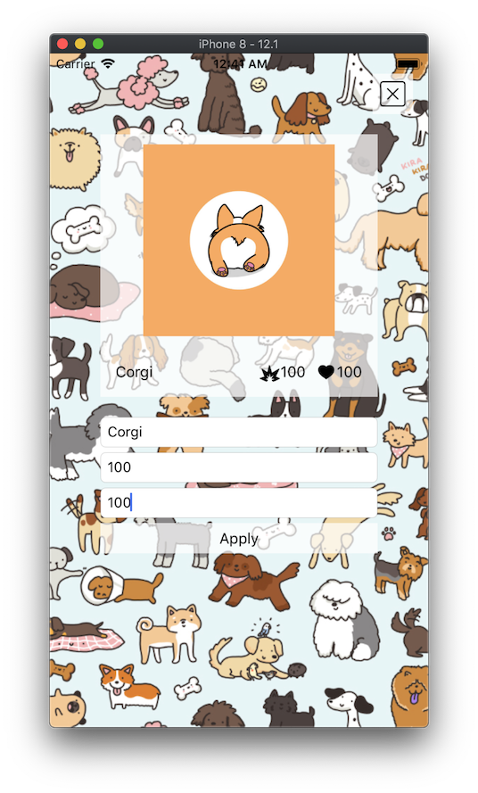
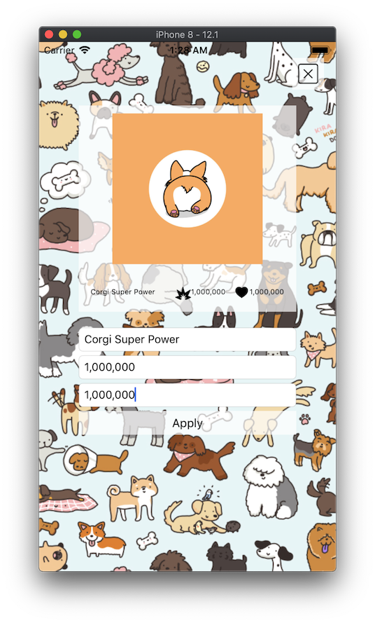
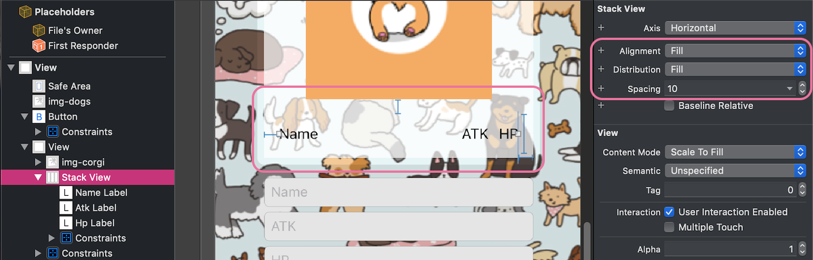
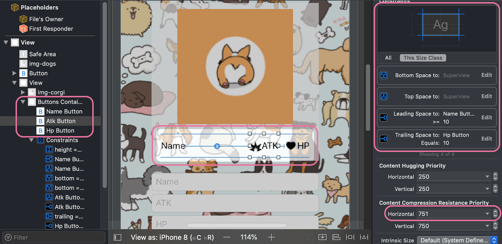

## Decrease font size of multiple UILabel and UIButton down to the same when content of them is expanding

*Written by: __Nguyen Minh Tam__*

### Ví dụ 1: 

Có 3 `UILabel` cùng nằm trên một hàng có nội dung thay đổi, theo thứ tự như sau: 

- Name
- ATK
- HP

Trong đó, Name được căn trái, ATK và HP căn phải. 

Yêu cầu: Khi nội dung của Name, ATK và HP cùng dài ra, font size của 3 `UILabel` này phải giảm xuống bằng nhau.


### Ví dụ 2:

Tương tự ví dụ 1, nhưng thay 3 `UILabel` bằng 3 `UIButton`.

<center>
	
	
</center>


### Giải pháp

Đối với ví dụ 1:

- Sử dụng `UIStackView`
- Tính toán và điều chỉnh lại font size

Đối với ví dụ 2:

- Tính toán và điều chỉnh lại font size


### Sử dụng UIStackView

- Bước 1: Đưa 3 `UILabel` `nameLabel`, `atkLabel` và `hpLabel` vào `UIStackView` `stackView`.
- Bước 2: Auto layout và config `stackView`:
 - Auto layout và config bằng Interface Builder:

<center>
	
</center>

 - Config bằng code:

```swift
// class DecreaseFontSizeOfLabelsVC: UIViewController
    private func configDefaultStackView() {
        stackView.alignment = .fill
        stackView.distribution = .fill
    }
```

- Bước 3: Config các `UILabel` như sau:
 - Set `adjustsFontSizeToFitWidth = true`
 - Set `numberOfLines = 1`
 - Set `minimumScaleFactor = 0.5`
 - Set content-hugging priority của `nameLabel`, `atkLabel` và `hpLabel` cho `horizontal` lần lợt là 250, 251 và 252.
   
 - Config bằng Interface Builder:

<center>
	
</center>

 - Config bằng code:

```swift
// class DecreaseFontSizeOfLabelsVC: UIViewController
    private func configDefaultLabels() {
        configDefaultLabel(nameLabel, huggingPriority: 250)
        configDefaultLabel(atkLabel, huggingPriority: 251)
        configDefaultLabel(hpLabel, huggingPriority: 252)
    }

    private func configDefaultLabel(_ label: UILabel, huggingPriority: Float) {
        label.font = Config.defaultFont
        label.adjustsFontSizeToFitWidth = true
        label.numberOfLines = 1
        label.minimumScaleFactor = 0.5
        label.setContentHuggingPriority(UILayoutPriority(huggingPriority), for: .horizontal)
    }
```

- Bước 4: Khi thay đổi nội dung của 3 label (nhấn Apply để thay đổi nội dung của label), nếu chiều rộng nội dung của các label tràn chiều rộng của `stackView` thì set `distribution = .fillProportionally`, ngược lại thì set `distribution = .fill`. Tham khảo thêm tại [UIStackView.Distribution][Reference 3].

```swift
// class DecreaseFontSizeOfLabelsVC: UIViewController
    @IBAction func applyBtnTouchUpInside(_ sender: Any) {
        ...
        let expectedWidth = name.contentWidth(font: Config.defaultFont) +
            atk.contentWidth(font: Config.defaultFont) +
            hp.contentWidth(font: Config.defaultFont) +
            Config.stackViewSpacing * 2

        stackView.distribution = expectedWidth > stackView.bounds.width ? .fillProportionally : .fill
    }
```

Tuy nhiên giải pháp sử dụng UIStackView chưa hoàn toàn toàn diện, vì trong một số trường hợp, font size của các label giảm không đều nhau bởi `contentHuggingPriority` mình set trước đó. Tham khảo thêm tại [Views with Intrinsic Content Size][Reference 2].

Giải pháp tính toán và điểu chỉnh lại font size được trình bày dưới đây cho phép mình giảm chính xác hơn.


### Tính toán và điều chỉnh lại font size

Giải pháp sau đây mình sẽ áp dụng cho Ví dụ 2.

- Bước 1: Đưa `nameLabel`, `atkButton` và `hpButton` vào `UIView` `buttonsContainerView`. 

- Bước 2: Auto layout và config các button như sau:
 - Nail `nameLabel` bên trái, `atkButton` và `hpButton` bên phải.
 - Set compression-resistance priority cho `nameButton`, `atkButton` và `hpButton` lần lượt là 750, 751, 752.
 - Config bằng Interface Builder:

<center>
	
</center>

 - Config bằng code:
  
```swift
// class DecreaseFontSizeOfButtonsVC: UIViewController
    private func configDefaultButtons() {
        configDefaultButton(nameButton, compressionPriority: 750)
        configDefaultButton(atkButton, compressionPriority: 751)
        configDefaultButton(hpButton, compressionPriority: 752)
    }

    private func configDefaultButton(_ button: UIButton, compressionPriority: Float) {
        // Set up label
        let priority = UILayoutPriority(rawValue: compressionPriority)
        button.setContentCompressionResistancePriority(priority, for: .horizontal)
        button.setTitleColor(.black, for: .normal)

        // Set up title label
        button.titleLabel?.font = Config.defaultFont
        button.titleLabel?.lineBreakMode = .byTruncatingTail
    }
```
- Bước 3: Khi thay đổi nội dung của 3 button (nhấn Apply để thay đổi nội dung của button), thực hiện tính toán và điều chỉnh font size của các button.

```swift
// class DecreaseFontSizeOfButtonsVC: UIViewController
    private func updateButtonsTitle() {
        nameButton.setTitle(name, for: .normal)
        atkButton.setTitle(atk, for: .normal)
        hpButton.setTitle(hp, for: .normal)
    }

    private func updateButtonsFont() {
        let nameWidth = name.contentWidth(font: Config.defaultFont)
        let atkWidth = atk.contentWidth(font: Config.defaultFont)
        let hpWidth = hp.contentWidth(font: Config.defaultFont)
        let sumStringsWidth = nameWidth + atkWidth + hpWidth

        let sumSpacing: CGFloat = Config.buttonSpacing * 2 + // There're 3 buttons -> 2 button spacings
            Config.buttonImageWidth * 2 + // There'r 2 buttons that have image, open debug views to get this number
            Config.insideButtonSpacing * 2 // There'r 2 buttons that have image, open debug views to get this number

        let nameRealWidth = ((buttonsContainerView.bounds.width - sumSpacing) / sumStringsWidth * nameWidth)

        let expectedFontSizeToFitNameLabel = ((nameRealWidth / nameWidth) * Config.defaultFontSize).rounded(.down) - 1 // In some cases, need to minus 1 pt

        let newFontSize = min(expectedFontSizeToFitNameLabel, Config.defaultFontSize)

        updateButtonFont(nameButton, size: newFontSize)
        updateButtonFont(atkButton, size: newFontSize)
        updateButtonFont(hpButton, size: newFontSize)
    }

    private func updateButtonFont(_ button: UIButton, size: CGFloat) {
        button.titleLabel?.font = UIFont.systemFont(ofSize: size)
    }
```
Với `func contentWidth(font:)` như sau:

```swift
extension String {
    func contentWidth(font: UIFont) -> CGFloat {
        let size = (self as NSString).size(withAttributes: [.font: font])
        return size.width
    }
}
```


### More

Quay lại [Daijobu Project][Daijobu]


### Reference

[UIStackView][Reference 1]

[Views with Intrinsic Content Size][Reference 2]

[UIStackView.Distribution][Reference 3]

---

[Daijobu]: https://github.com/nmint8m/daijobu

[Reference 1]: https://developer.apple.com/library/archive/documentation/UserExperience/Conceptual/AutolayoutPG/LayoutUsingStackViews.html#//apple_ref/doc/uid/TP40010853-CH11-SW1 "UIStackView" 

[Reference 2]: https://developer.apple.com/library/archive/documentation/UserExperience/Conceptual/AutolayoutPG/ViewswithIntrinsicContentSize.html "Views with Intrinsic Content Size"

[Reference 3]: https://developer.apple.com/documentation/uikit/uistackview/distribution "UIStackView.Distribution"
