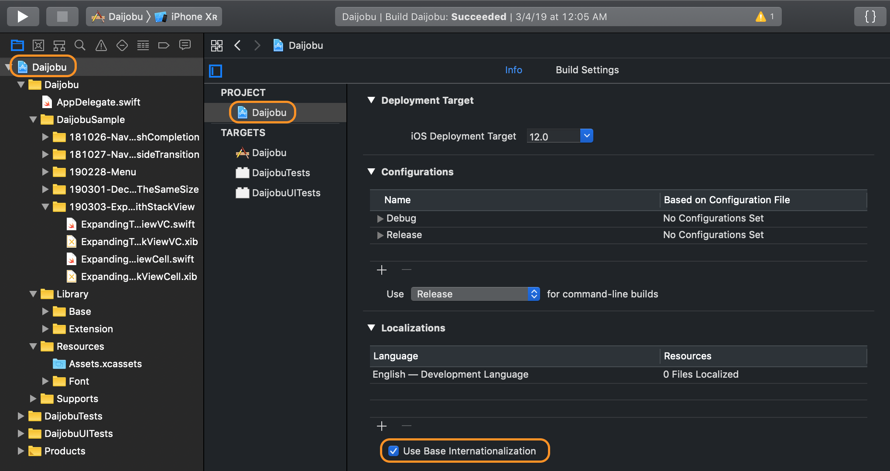
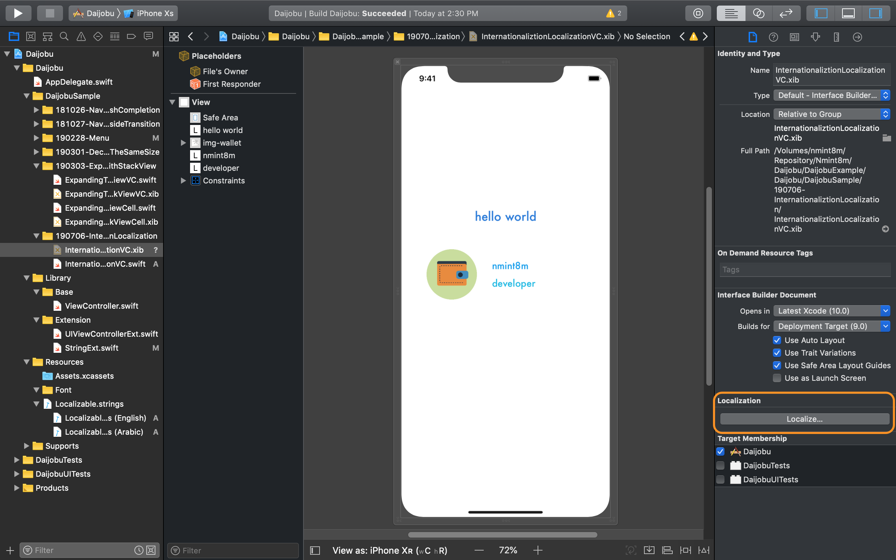

## Internationalization and Localization

### Mục tiêu:

- User sử dụng nhiều ngôn ngữ trong cùng một app.
- Layout linh hoạt thay đổi theo chiều trái sang phải và phải sang trái.
- Sử dụng built trong xliff generator.
- Không sử dụng nhiều story board.
- Đơn giản.

### Ví dụ

- Sử dụng:
  - English
  - Arabic

### Localization trong file `.xib` với `.lproj`

- Đầu tiên chọn `Use Base Internationalization`.

    

- `Base.lproj`:
  - Lần đầu tiên khi khởi tạo project mới, XCode tự động tạo các resource và file structure, trong đó bao gồm cả default language.
  - `Base.lproj` chứa các resource liên quan đến base language.
- Tương tự:
  - `ar.lproj` chứa các resource liên quan đến tiếng Ả rập.
  - `en.lproj` chứa các resource liên quan đến tiếng Anh

    

- Nhấn vào nút `+` để thêm ngôn ngữ mà ta muốn support

    

- Tạo một view controller mới có file `.xib`:

    

- Chọn `Localize...` cho cả `Base`, `English` và `Arabic` để tạo ra các resource giành riêng cho mỗi language. Trong đó, setting cho `English` và `Arabic` sử dụng `Localizable Strings` thay vì `Interface Builder Cocoa Touch XIB`.
- Như vậy:
  - File `.xib` giờ sẽ nằm ở `Base.lproj`
  - Hai file `.string` sẽ nằm ở `ar.lproj` và `en.lpoj`

    

    

- Sửa các string trong file strings ở `ar.lproj` như trên.
- Chạy thử app và đổi app language bằng cách edit scheme:

    

    

- Kết qủa thu được như sau:

| Arabic | English |
|---|---|
|  |  |

### More

Quay lại [Daijobu Project][Daijobu]

### Reference

[Working with Internationalization and Localization in swift] [Reference 1]

[Daijobu]: https://github.com/nmint8m/daijobu

[Reference 1]: https://medium.com/if-let-swift-programming/working-with-localization-in-swift-4a87f0d393a4